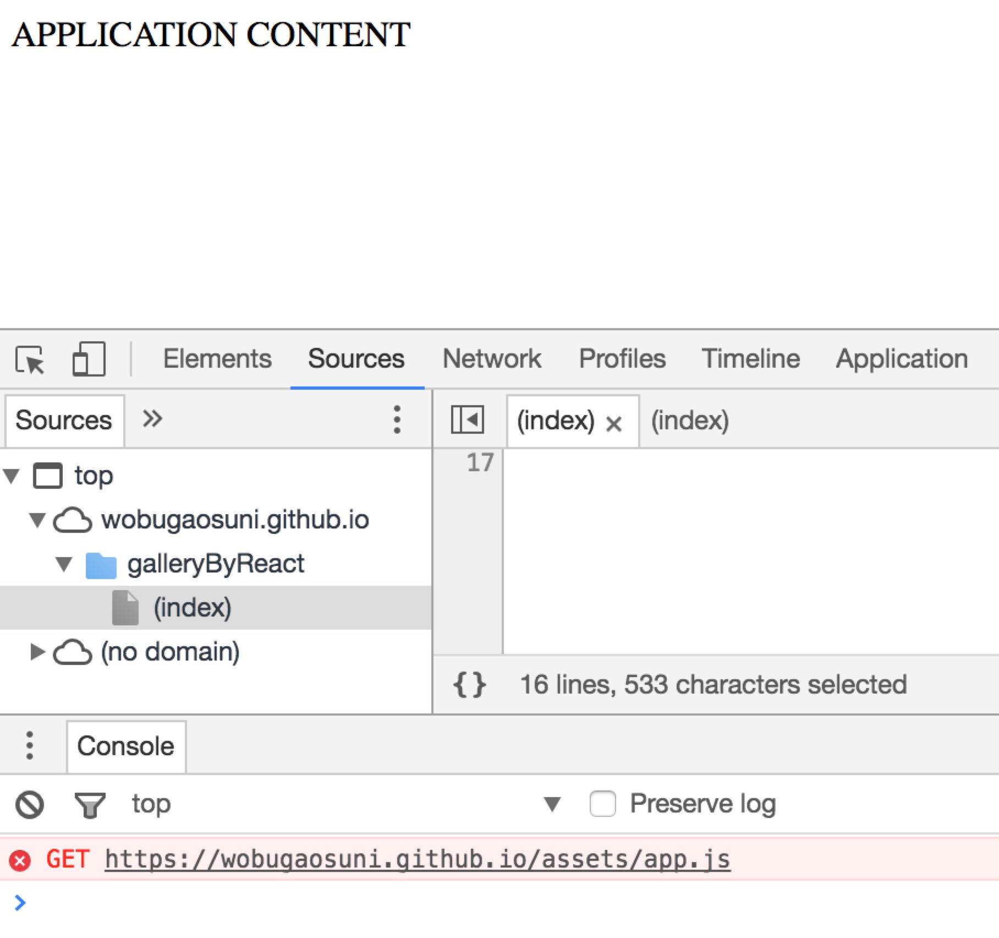

<article class="markdown-body entry-content" itemprop="text"><h1><a id="user-content-图片画廊web单页app" class="anchor" href="#图片画廊web单页app" aria-hidden="true"><svg aria-hidden="true" class="octicon octicon-link" height="16" version="1.1" viewBox="0 0 16 16" width="16"><path fill-rule="evenodd" d="M4 9h1v1H4c-1.5 0-3-1.69-3-3.5S2.55 3 4 3h4c1.45 0 3 1.69 3 3.5 0 1.41-.91 2.72-2 3.25V8.59c.58-.45 1-1.27 1-2.09C10 5.22 8.98 4 8 4H4c-.98 0-2 1.22-2 2.5S3 9 4 9zm9-3h-1v1h1c1 0 2 1.22 2 2.5S13.98 12 13 12H9c-.98 0-2-1.22-2-2.5 0-.83.42-1.64 1-2.09V6.25c-1.09.53-2 1.84-2 3.25C6 11.31 7.55 13 9 13h4c1.45 0 3-1.69 3-3.5S14.5 6 13 6z"></path></svg></a>图片画廊web单页APP</h1>
<h2><a id="user-content-项目概览" class="anchor" href="#项目概览" aria-hidden="true"><svg aria-hidden="true" class="octicon octicon-link" height="16" version="1.1" viewBox="0 0 16 16" width="16"><path fill-rule="evenodd" d="M4 9h1v1H4c-1.5 0-3-1.69-3-3.5S2.55 3 4 3h4c1.45 0 3 1.69 3 3.5 0 1.41-.91 2.72-2 3.25V8.59c.58-.45 1-1.27 1-2.09C10 5.22 8.98 4 8 4H4c-.98 0-2 1.22-2 2.5S3 9 4 9zm9-3h-1v1h1c1 0 2 1.22 2 2.5S13.98 12 13 12H9c-.98 0-2-1.22-2-2.5 0-.83.42-1.64 1-2.09V6.25c-1.09.53-2 1.84-2 3.25C6 11.31 7.55 13 9 13h4c1.45 0 3-1.69 3-3.5S14.5 6 13 6z"></path></svg></a>项目概览</h2>

演示地址：<a href="https://samday622.github.io/gallery-by-react/">https://samday622.github.io/gallery-by-react/</a>

基本需求：

<ul>
<li>刷新网页，每张图片随机排布，而且图片在-30度~30度之间随机旋转</li>
<li>点击位于中心的图片，翻转</li>
<li>点击除了中心外的图片，与中心图片互换位置</li>
<li>圆点导航栏：
<ul>
<li>位于中心的图片所在的导航点，高亮显示。点击该圆点，图片翻转</li>
<li>位于四周的图片所在的导航点，被点击时，与中心图片互换位置</li>
</ul>
</li>
</ul>
<h2><a id="user-content-项目说明" class="anchor" href="#项目说明" aria-hidden="true"><svg aria-hidden="true" class="octicon octicon-link" height="16" version="1.1" viewBox="0 0 16 16" width="16"><path fill-rule="evenodd" d="M4 9h1v1H4c-1.5 0-3-1.69-3-3.5S2.55 3 4 3h4c1.45 0 3 1.69 3 3.5 0 1.41-.91 2.72-2 3.25V8.59c.58-.45 1-1.27 1-2.09C10 5.22 8.98 4 8 4H4c-.98 0-2 1.22-2 2.5S3 9 4 9zm9-3h-1v1h1c1 0 2 1.22 2 2.5S13.98 12 13 12H9c-.98 0-2-1.22-2-2.5 0-.83.42-1.64 1-2.09V6.25c-1.09.53-2 1.84-2 3.25C6 11.31 7.55 13 9 13h4c1.45 0 3-1.69 3-3.5S14.5 6 13 6z"></path></svg></a>项目说明</h2>
<ul>
<li>构建工具 <a href="http://yeoman.io/">Yeoman</a>，构建项目命令：<code>yo react-webpack gallery-by-react</code></li>
<li>脚手架 <a href="https://github.com/react-webpack-generators/generator-react-webpack">generator-react-webpack</a></li>
<li>SCSS编译 <a href="https://github.com/postcss/autoprefixer">autoprefixer</a></li>
<li>技术栈<code>React + Webpack + SCSS</code></li>
<li>使用<code>react+ES6</code>框架完成画廊页面制作</li>
<li>使用<code>CSS3</code>的transition属性，实现旋转、平移、背景色的逐渐过渡</li>
<li>使用<code>iconfont</code>字体文件代替图片文件，支持CSS3对字体的修饰效果</li>
</ul>
<h2><a id="user-content-在本地打开项目" class="anchor" href="#在本地打开项目" aria-hidden="true"><svg aria-hidden="true" class="octicon octicon-link" height="16" version="1.1" viewBox="0 0 16 16" width="16"><path fill-rule="evenodd" d="M4 9h1v1H4c-1.5 0-3-1.69-3-3.5S2.55 3 4 3h4c1.45 0 3 1.69 3 3.5 0 1.41-.91 2.72-2 3.25V8.59c.58-.45 1-1.27 1-2.09C10 5.22 8.98 4 8 4H4c-.98 0-2 1.22-2 2.5S3 9 4 9zm9-3h-1v1h1c1 0 2 1.22 2 2.5S13.98 12 13 12H9c-.98 0-2-1.22-2-2.5 0-.83.42-1.64 1-2.09V6.25c-1.09.53-2 1.84-2 3.25C6 11.31 7.55 13 9 13h4c1.45 0 3-1.69 3-3.5S14.5 6 13 6z"></path></svg></a>在本地打开项目</h2>

<pre># 在终端执行以下命令安装环境依赖(下载慢的情况下，可以使用淘宝镜像：cnpm；或者直接在终端使用代理翻墙)
npm install
# 安装成功后执行以下命令，即可在浏览器中打开
npm start
# dist文件的编译，执行
npm run dist</pre>

<h2><a id="user-content-踩坑总结" class="anchor" href="#踩坑总结" aria-hidden="true"><svg aria-hidden="true" class="octicon octicon-link" height="16" version="1.1" viewBox="0 0 16 16" width="16"><path fill-rule="evenodd" d="M4 9h1v1H4c-1.5 0-3-1.69-3-3.5S2.55 3 4 3h4c1.45 0 3 1.69 3 3.5 0 1.41-.91 2.72-2 3.25V8.59c.58-.45 1-1.27 1-2.09C10 5.22 8.98 4 8 4H4c-.98 0-2 1.22-2 2.5S3 9 4 9zm9-3h-1v1h1c1 0 2 1.22 2 2.5S13.98 12 13 12H9c-.98 0-2-1.22-2-2.5 0-.83.42-1.64 1-2.09V6.25c-1.09.53-2 1.84-2 3.25C6 11.31 7.55 13 9 13h4c1.45 0 3-1.69 3-3.5S14.5 6 13 6z"></path></svg></a>踩坑总结</h2>
<ul>
<li>新版generator-react-webpack生成的工程环境移除了grunt，运行命令<code>npm run start</code></li>
<li>以往webpack.config.js的配置内容在cfg/default.js中配置</li>
<li>构建出的工作环境webpack默认版本为1.x，不包含json-loader. 
解析.json文件一种解决办法是安装json-loader，并在default.js中配置。<a href="https://github.com/webpack-contrib/json-loader">json-loader</a> 
另一种解决办法是全局安装webpack2.x及以上版本，自带有json-loader <code>npm install -g webpack@2.x</code> 
<strong>注：require时都必须加上json!前缀</strong></li>
<li>需自行安装sass-loader，安装参考<a href="https://github.com/webpack-contrib/sass-loader">sass-loader</a> 
(<strong>注：不要安装最新版本的sass</strong>，会出现版本依赖错误，可以参考安装node-sass4.x和sass-loader3.x版本，我尝试过不会出现错误)</li>
<li>react需更新组件时是通过DOM与virtual DOM的对比来实现，如果有变化就重新渲染，因此在每次forEach循环添加节点都应给组件添加一个key，以优化对比</li>
<li>图标字体可以在<a href="http://www.iconfont.cn/">阿里开源图标库</a>下载代码，在文件中有对应图标的Unicode码</li>
<li>用styleObj对象为组件添加样式时注意一定要使用驼峰命名规则</li>
<li>关于inverse和center使用闭包函数的原因，这两个函数都调用到了图片数组下标index，跟随对象的初始化保存，避免被JavaScript的垃圾回收机制回收。</li>
</ul>

屏幕渲染机制有两种：

<ul>
<li>灰阶渲染：控制边缘亮度，所耗内存相对较低，应用于手机</li>
<li>亚像素渲染：效果更好，所耗内存相对更高，应用于Mac等</li>
</ul>

Mac上有些浅色字体图片（在上面设置了白色，可以设置为深色进行测试）在浏览器上显得较粗   

解决方案：在父元素上设置属性，修改浏览器的属性：   

<pre>-webkit-font-smoothing: antialiased; /* 开启chrome在Mac下字体渲染的灰阶平滑 */  &lt;br /&gt;
-moz-osx-font-smoothing: grayscale; /* 开启firefox在Mac下字体渲染的灰阶平滑 */</pre>

<h2><a id="user-content-遇到的困难和解决方法" class="anchor" href="#遇到的困难和解决方法" aria-hidden="true"><svg aria-hidden="true" class="octicon octicon-link" height="16" version="1.1" viewBox="0 0 16 16" width="16"><path fill-rule="evenodd" d="M4 9h1v1H4c-1.5 0-3-1.69-3-3.5S2.55 3 4 3h4c1.45 0 3 1.69 3 3.5 0 1.41-.91 2.72-2 3.25V8.59c.58-.45 1-1.27 1-2.09C10 5.22 8.98 4 8 4H4c-.98 0-2 1.22-2 2.5S3 9 4 9zm9-3h-1v1h1c1 0 2 1.22 2 2.5S13.98 12 13 12H9c-.98 0-2-1.22-2-2.5 0-.83.42-1.64 1-2.09V6.25c-1.09.53-2 1.84-2 3.25C6 11.31 7.55 13 9 13h4c1.45 0 3-1.69 3-3.5S14.5 6 13 6z"></path></svg></a>遇到的困难和解决方法</h2>
<h3><a id="user-content-1-翻转函数和样式的实现" class="anchor" href="#1-翻转函数和样式的实现" aria-hidden="true"><svg aria-hidden="true" class="octicon octicon-link" height="16" version="1.1" viewBox="0 0 16 16" width="16"><path fill-rule="evenodd" d="M4 9h1v1H4c-1.5 0-3-1.69-3-3.5S2.55 3 4 3h4c1.45 0 3 1.69 3 3.5 0 1.41-.91 2.72-2 3.25V8.59c.58-.45 1-1.27 1-2.09C10 5.22 8.98 4 8 4H4c-.98 0-2 1.22-2 2.5S3 9 4 9zm9-3h-1v1h1c1 0 2 1.22 2 2.5S13.98 12 13 12H9c-.98 0-2-1.22-2-2.5 0-.83.42-1.64 1-2.09V6.25c-1.09.53-2 1.84-2 3.25C6 11.31 7.55 13 9 13h4c1.45 0 3-1.69 3-3.5S14.5 6 13 6z"></path></svg></a>1. 翻转函数和样式的实现</h3>
<ul>
<li>解决方法: 规划好整个组件的排版布局，如下。通过类名控制翻转</li>
</ul>
  
<pre>&lt;section&gt; -- relative
  &lt;section&gt; -- relative
    &lt;figure&gt; -- absolute
      &lt;img /&gt;
      &lt;figcaption&gt;
        &lt;h2&gt;(图片正面描述)&lt;/h2&gt;
        &lt;div&gt;(图片背面描述)&lt;/div&gt; -- absolute
      &lt;/figcaption&gt;
    &lt;/figure&gt;
  &lt;/section&gt;
  &lt;nav&gt; -- absolute
    （导航点组件)
  &lt;/nav&gt;
&lt;/section&gt;</pre>

由于实现图片翻转有两种方式：点击图片自身 + 点击导航点  
因此翻转函数写在父组件为宜，直接return一个闭包函数

<h3><a id="user-content-2-把项目发布到gh-pages分支" class="anchor" href="#2-把项目发布到gh-pages分支" aria-hidden="true"><svg aria-hidden="true" class="octicon octicon-link" height="16" version="1.1" viewBox="0 0 16 16" width="16"><path fill-rule="evenodd" d="M4 9h1v1H4c-1.5 0-3-1.69-3-3.5S2.55 3 4 3h4c1.45 0 3 1.69 3 3.5 0 1.41-.91 2.72-2 3.25V8.59c.58-.45 1-1.27 1-2.09C10 5.22 8.98 4 8 4H4c-.98 0-2 1.22-2 2.5S3 9 4 9zm9-3h-1v1h1c1 0 2 1.22 2 2.5S13.98 12 13 12H9c-.98 0-2-1.22-2-2.5 0-.83.42-1.64 1-2.09V6.25c-1.09.53-2 1.84-2 3.25C6 11.31 7.55 13 9 13h4c1.45 0 3-1.69 3-3.5S14.5 6 13 6z"></path></svg></a>2. 把项目发布到gh-pages分支</h3>
<ul>
<li>

路径错误

原因： 
在本地编译时，由于运行时是在根目录，可以写绝对路径  
但在生成的网页中，项目处于二级目录下，需要将编译后的绝对地址改为相对地址  

<ol>
<li>将绝对路径改为相对路径</li>
</ol>

<pre>#default.js:
`publicPath: '/assets/',` 改成：`publicPath: 'gallaryByReact/assets/',`

#index.html:
`&lt;script type="text/javascript" src="/assets/app.js"&gt;&lt;/script&gt;`
改成：`&lt;script type="text/javascript" src="assets/app.js"&gt;&lt;/script&gt;`</pre>

<ol start="2">
<li>

在终端重新编译dist，执行：<code>npm run dist</code>

</li>
<li>

把修改的dist提交到gh-pages分支  
<code>git add dist</code>  
<code>git commit -m "change path from absolute to relative"</code>  
<code>git subtree push --prefix=dist origin gh-pages</code>

</li>
</ol>
 
</li>
<li>

图片没有编译到dist目录

原因： 
npm run dist时，没有把images目录包含进去  
<code>"copy": "copyfiles -f ./src/index.html ./src/favicon.ico ./dist"</code>  

解决方法：增加images目录到dist，如下  
<code>"copy": "copyfiles -f ./src/index.html ./src/favicon.ico ./dist &amp;&amp; cp -a ./src/images ./dist/"</code>

</li>
</ul>

</article>
